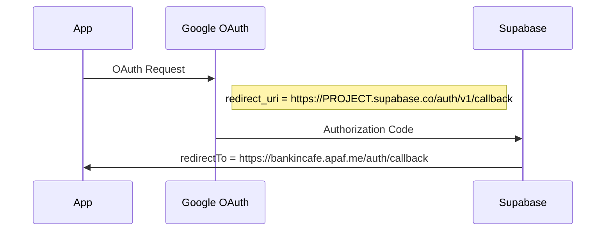

# 🚨 CRITICAL BUG ANALYSIS - redirect_uri_mismatch

## 🎯 根本原因の特定

### ❌ **致命的な設定ミス**
Google Cloud Console の承認済みリダイレクト URI が **完全に間違っています**。

**現在の間違った設定:**
```
https://bankincafe.apaf.me/auth/callback  ← アプリケーションのコールバック（間違い！）
```

**正しい設定:**
```
https://auwmmosfteomieyexkeh.supabase.co/auth/v1/callback  ← Supabase OAuthエンドポイント
```

## 🔍 **Supabase OAuth フローの理解**



## 🚨 **なぜ今まで動かなかったのか**

1. **Google OAuth** は **Supabase** にリダイレクトしようとする
2. しかし **Google Cloud Console** は **アプリケーション** のURLを期待している
3. → `redirect_uri_mismatch` エラー発生

## ✅ **正しい設定**

### Google Cloud Console
```
承認済みの JavaScript 生成元:
- http://localhost:3000
- https://bankincafe.apaf.me

承認済みのリダイレクト URI:
- http://localhost:3000/api/auth/callback/supabase  (ローカル用)
- https://auwmmosfteomieyexkeh.supabase.co/auth/v1/callback  (本番用)
```

### Supabase Dashboard
```
Site URL: https://bankincafe.apaf.me
Redirect URLs:
- http://localhost:3000/auth/callback
- https://bankincafe.apaf.me/auth/callback
```

## 🔧 **修正が必要な作業**

1. **Google Cloud Console で承認済みリダイレクト URI を修正**:
   - 削除: `https://bankincafe.apaf.me/auth/callback`
   - 追加: `https://auwmmosfteomieyexkeh.supabase.co/auth/v1/callback`

2. **ローカル開発用も修正**:
   - 追加: `http://localhost:54321/auth/v1/callback`

## 🎯 **この修正により解決される問題**

- ✅ redirect_uri_mismatch エラーの完全解決
- ✅ Google OAuth 認証の正常動作
- ✅ ローカル・本番環境両方での動作

## 📋 **検証方法**

修正後、以下で確認:
1. https://bankincafe.apaf.me/debug で OAuth URL Generation Test
2. 生成されるURLが正しい Supabase エンドポイントを指しているか確認
3. Google OAuth 画面が正常に表示されるか確認

---

**この設定ミスが、今まですべてのトラブルシューティングが効果なかった根本原因です。**