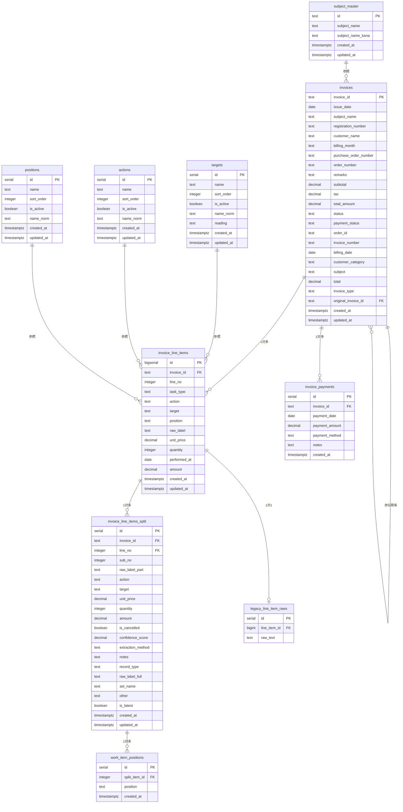

# データベース設計書 - 板金請求書システム

## 📋 システム概要

板金・整備業務の請求書管理システムのデータベース構造です。請求書の作成、明細管理、作業項目の分割表示、売上分析機能を提供します。

---

## 🗂️ テーブル構造

### 1. **invoices** - 請求書ヘッダー
**目的**: 請求書の基本情報を管理

| カラム名 | データ型 | NULL | デフォルト | 説明 | 例 |
|----------|----------|------|----------|------|-----|
| invoice_id | TEXT | NO | - | 請求書ID（主キー） | 25043371-1 |
| issue_date | DATE | YES | - | 発行日 | 2025-04-27 |
| subject_name | TEXT | YES | - | 件名（元フィールド） | エンジン修理 |
| registration_number | TEXT | YES | - | 車両登録番号 | 品川500あ1234 |
| customer_name | TEXT | YES | - | 顧客名 | UDトラックス株式会社 |
| billing_month | TEXT | YES | - | 請求月（YYMM形式）| 2504 |
| purchase_order_number | TEXT | YES | - | 発注番号 | 1700414294 |
| order_number | TEXT | YES | - | オーダー番号 | 2501852-01 |
| remarks | TEXT | YES | - | 備考 | 特記事項 |
| subtotal | NUMERIC(12,0) | YES | 0 | 小計 | 13200 |
| tax | NUMERIC(12,0) | YES | 0 | 消費税 | 1200 |
| total_amount | NUMERIC(12,0) | YES | 0 | 請求総額 | 14400 |
| status | TEXT | YES | 'draft' | ステータス | finalized |
| payment_status | TEXT | YES | 'unpaid' | 支払い状況 | unpaid |
| order_id | TEXT | YES | - | オーダーID | ord_123 |
| invoice_number | TEXT | YES | - | 請求書番号 | 25043371-1 |
| billing_date | DATE | YES | - | 請求日 | 2025-04-27 |
| customer_category | TEXT | YES | 'その他' | 顧客カテゴリ | UD |
| subject | TEXT | YES | - | 件名 | エンジン修理 |
| total | NUMERIC(12,0) | YES | 0 | 合計金額 | 14400 |
| invoice_type | TEXT | YES | 'standard' | 請求書種別 | standard |
| original_invoice_id | TEXT | YES | - | 元請求書ID（赤伝用） | 25043371-1 |
| created_at | TIMESTAMPTZ | YES | now() | 作成日時 | 2025-08-30T10:00:00Z |
| updated_at | TIMESTAMPTZ | YES | now() | 更新日時 | 2025-08-30T10:00:00Z |

#### **制約条件**

**status** の値（CHECKスペック）:
- `draft` - 下書き
- `finalized` - 確定
- `sent` - 送信済み
- `paid` - 支払済み

**payment_status** の値（CHECKスペック）:
- `paid` - 支払済み
- `unpaid` - 未払い
- `partial` - 一部入金

**customer_category** の値（CHECKスペック）:
- `UD` - UDトラックス関連
- `その他` - その他の顧客

**invoice_type** の値（CHECKスペック）:
- `standard` - 通常請求書
- `credit_note` - 赤伝（クレジットノート）

#### **自動計算トリガー**
- `subtotal`, `tax`, `total` は `invoice_line_items` の変更時に自動計算
- `tax` = `subtotal` × 0.1（四捨五入）
- `total` = `subtotal` × 1.1

---

### 2. **invoice_line_items** - 請求書明細
**目的**: 各請求書の作業項目明細を管理

| カラム名 | データ型 | NULL | デフォルト | 説明 | 例 |
|----------|----------|------|----------|------|-----|
| id | BIGSERIAL | NO | - | ID（主キー） | 1 |
| invoice_id | TEXT | NO | - | 請求書ID（外部キー） | 25043371-1 |
| line_no | INTEGER | NO | - | 明細行番号 | 1 |
| task_type | TEXT | NO | - | 作業タイプ | T |
| action | TEXT | YES | - | 作業動作 | 脱着 |
| target | TEXT | YES | - | 対象物 | バンパー |
| position | TEXT | YES | - | 部位 | 右前 |
| raw_label | TEXT | YES | - | 原文ラベル | 右バンパー脱着・修理 |
| unit_price | NUMERIC(12,0) | YES | - | 単価 | 8000 |
| quantity | INTEGER | YES | - | 数量 | 1 |
| performed_at | DATE | YES | - | 作業実施日 | 2025-04-27 |
| amount | NUMERIC(12,0) | YES | - | 金額 | 8000 |
| created_at | TIMESTAMPTZ | YES | now() | 作成日時 | 2025-08-30T10:00:00Z |
| updated_at | TIMESTAMPTZ | YES | now() | 更新日時 | 2025-08-30T10:00:00Z |

#### **task_type** の値
- `T` - 個別作業（Individual Task）
- `S` - セット作業（Set Task）
- `fuzzy` - 非構造化データ（分割対象）
- `structured` - 構造化データ（分解済み）

#### **外部キー制約**
- `invoice_id` REFERENCES `invoices(invoice_id)` ON DELETE CASCADE
- UNIQUE制約: `(invoice_id, line_no)`

---

### 3. **invoice_line_items_split** - 作業明細分割項目
**目的**: 複合作業項目を個別の作業単位に分割して管理

| カラム名 | データ型 | NULL | デフォルト | 説明 | 例 |
|----------|----------|------|----------|------|-----|
| id | SERIAL | NO | - | ID（主キー） | 1 |
| invoice_id | TEXT | NO | - | 請求書ID | 25043371-1 |
| line_no | INTEGER | NO | - | 明細行番号 | 1 |
| sub_no | INTEGER | NO | - | 分割連番 | 1 |
| raw_label_part | TEXT | NO | - | 分割後の原文 | 左ファーストステップ |
| action | TEXT | YES | - | 作業動作 | 脱着 |
| target | TEXT | YES | - | 対象物 | ステップ |
| unit_price | DECIMAL(12,2) | NO | - | 単価 | 6000.00 |
| quantity | INTEGER | NO | - | 数量 | 1 |
| amount | DECIMAL(12,2) | NO | - | 金額 | 6000.00 |
| is_cancelled | BOOLEAN | NO | false | 取消しフラグ | false |
| confidence_score | DECIMAL(3,2) | YES | - | 抽出信頼度 | 0.95 |
| extraction_method | TEXT | YES | - | 抽出方法 | manual |
| notes | TEXT | YES | - | 備考 | 特殊加工 |
| record_type | TEXT | YES | - | レコード種別 | split |
| raw_label_full | TEXT | YES | - | 完全な原文 | 元の完全ラベル |
| set_name | TEXT | YES | - | セット名 | バンパー作業一式 |
| other | TEXT | YES | - | その他情報 | - |
| is_latest | BOOLEAN | NO | true | 最新フラグ | true |
| created_at | TIMESTAMPTZ | YES | now() | 作成日時 | 2025-08-30T10:00:00Z |
| updated_at | TIMESTAMPTZ | YES | now() | 更新日時 | 2025-08-30T10:00:00Z |

#### **外部キー制約**
- `(invoice_id, line_no)` REFERENCES `invoice_line_items(invoice_id, line_no)`
- UNIQUE制約: `(invoice_id, line_no, sub_no)`

---

### 4. **work_item_positions** - 作業項目位置情報 ⚠️空テーブル
**目的**: 1つの作業項目が持つ複数の位置情報（例：「右」「前」）を正確に管理

| カラム名 | データ型 | NULL | デフォルト | 説明 | 例 |
|----------|----------|------|----------|------|-----|
| id | SERIAL | NO | - | ID（主キー） | 1 |
| split_item_id | INTEGER | NO | - | 分割項目ID（外部キー） | 1 |
| position | TEXT | NO | - | 位置 | 右 |
| created_at | TIMESTAMPTZ | YES | now() | 作成日時 | 2025-09-05T10:00:00Z |

---

### 5. **invoice_payments** - 請求書入金履歴 ⚠️空テーブル
**目的**: 分割入金を含む、すべての入金履歴を正確に追跡管理

| カラム名 | データ型 | NULL | デフォルト | 説明 | 例 |
|----------|----------|------|----------|------|-----|
| id | SERIAL | NO | - | ID（主キー） | 1 |
| invoice_id | TEXT | NO | - | 請求書ID（外部キー） | 25043371-1 |
| payment_date | DATE | NO | - | 入金日 | 2025-05-15 |
| payment_amount | NUMERIC(12,0) | NO | - | 入金額 | 14400 |
| payment_method | TEXT | YES | - | 入金方法 | 銀行振込 |
| notes | TEXT | YES | - | 備考 | 一部入金 |
| created_at | TIMESTAMPTZ | YES | now() | 作成日時 | 2025-09-05T10:00:00Z |

---

### 6. **legacy_line_item_raws** - 旧システム原文データ ⚠️空テーブル
**目的**: 旧システムの曖昧な原文データを専用テーブルに隔離し、主要テーブルのデータ整合性を保つ

| カラム名 | データ型 | NULL | デフォルト | 説明 | 例 |
|----------|----------|------|----------|------|-----|
| id | SERIAL | NO | - | ID（主キー） | 1 |
| line_item_id | BIGINT | NO | - | 明細項目ID（外部キー） | 1 |
| raw_text | TEXT | NO | - | 原文テキスト | 右バンパー脱着・修理一式 |

---

## 🗂️ マスターテーブル群

### 7. **targets** - 作業対象マスタ
**目的**: 作業対象（部品）の標準化管理

| カラム名 | データ型 | NULL | デフォルト | 説明 | 例 |
|----------|----------|------|----------|------|-----|
| id | SERIAL | NO | - | ID（主キー） | 412 |
| name | TEXT | NO | - | 対象名 | ドア |
| sort_order | INTEGER | YES | - | ソート順 | 1 |
| is_active | BOOLEAN | NO | true | 有効フラグ | true |
| name_norm | TEXT | YES | - | 正規化名称 | ドア |
| reading | TEXT | YES | - | 読み仮名 | どあ |
| created_at | TIMESTAMPTZ | YES | now() | 作成日時 | 2025-09-06T12:32:53Z |
| updated_at | TIMESTAMPTZ | YES | now() | 更新日時 | 2025-09-06T12:32:53Z |

**データ件数**: 63件（ドア、サイドガード、ステー、ブラケット、パイプ等）

---

### 8. **actions** - 作業動作マスタ
**目的**: 作業動作の標準化管理

| カラム名 | データ型 | NULL | デフォルト | 説明 | 例 |
|----------|----------|------|----------|------|-----|
| id | SERIAL | NO | - | ID（主キー） | 281 |
| name | TEXT | NO | - | 動作名 | 取替 |
| sort_order | INTEGER | YES | - | ソート順 | 1 |
| is_active | BOOLEAN | NO | true | 有効フラグ | true |
| name_norm | TEXT | YES | - | 正規化名称 | 取替 |
| created_at | TIMESTAMPTZ | YES | now() | 作成日時 | 2025-09-06T12:32:53Z |
| updated_at | TIMESTAMPTZ | YES | now() | 更新日時 | 2025-09-06T12:32:53Z |

**データ件数**: 36件（取替、脱着、溶接、加工、交換等）

---

### 9. **positions** - 部位マスタ
**目的**: 作業部位の標準化管理

| カラム名 | データ型 | NULL | デフォルト | 説明 | 例 |
|----------|----------|------|----------|------|-----|
| id | SERIAL | NO | - | ID（主キー） | 155 |
| name | TEXT | NO | - | 部位名 | 左 |
| sort_order | INTEGER | YES | - | ソート順 | 1 |
| is_active | BOOLEAN | NO | true | 有効フラグ | true |
| name_norm | TEXT | YES | - | 正規化名称 | 左 |
| created_at | TIMESTAMPTZ | YES | now() | 作成日時 | 2025-09-06T12:32:53Z |
| updated_at | TIMESTAMPTZ | YES | now() | 更新日時 | 2025-09-06T12:32:53Z |

**データ件数**: 24件（左、右、前、後、1番、2番、3番等）

---

### 10. **subject_master** - 件名マスタ
**目的**: 請求書件名の標準化管理

| カラム名 | データ型 | NULL | デフォルト | 説明 | 例 |
|----------|----------|------|----------|------|-----|
| id | TEXT | NO | - | ID（UUID） | 331b4d88-9cdc-4f1b-922f-9b45ee327a62 |
| subject_name | TEXT | NO | - | 件名 | KD物流株式会社 |
| subject_name_kana | TEXT | YES | - | 件名カナ | けーでぃーぶつりゅう |
| created_at | TIMESTAMPTZ | YES | now() | 作成日時 | 2025-09-07T01:24:41Z |
| updated_at | TIMESTAMPTZ | YES | now() | 更新日時 | 2025-09-07T01:24:41Z |

**データ件数**: 207件

---

### 11. **customers** - 顧客マスタ ⚠️空テーブル
**目的**: 顧客情報管理（現在未使用）

---

### 12. **companies** - 会社マスタ ⚠️空テーブル
**目的**: 会社情報管理（現在未使用）

---

### 13. **customer_categories** - 顧客カテゴリマスタ ⚠️空テーブル
**目的**: 顧客分類管理（現在未使用）

---

## 🔗 テーブル関係図



---

## 📊 データ統計（2025年9月11日現在）

### **メインテーブル**
- **invoices**: 2,217件（請求書データ）
- **invoice_line_items**: 79件（明細データ）⚠️ **異常に少ない**
- **invoice_line_items_split**: 200件（分割データ）

### **マスターテーブル**
- **targets**: 63件（作業対象）
- **actions**: 36件（作業動作）
- **positions**: 24件（作業部位）
- **subject_master**: 207件（件名）

### **未使用テーブル**
- **work_item_positions**: 0件
- **invoice_payments**: 0件
- **legacy_line_item_raws**: 0件
- **customers**: 0件（NULL）
- **companies**: 0件（NULL）
- **customer_categories**: 0件（NULL）

### **⚠️ データ品質上の問題**
1. **請求書2,217件に対して明細79件** - 通常ありえない比率
2. **明細データの作業辞書連携不完全** - action, target, positionが多数空
3. **古いデータのみ** - 2023年9月以降のデータなし

---

## 🔧 インデックス設計

### **主要インデックス**
```sql
-- 請求書テーブル
PRIMARY KEY (invoice_id)
INDEX idx_invoices_issue_date ON invoices(issue_date)
INDEX idx_invoices_customer ON invoices(customer_name)
INDEX idx_invoices_type ON invoices(invoice_type)

-- 明細テーブル  
PRIMARY KEY (id)
UNIQUE (invoice_id, line_no)
INDEX idx_line_items_invoice ON invoice_line_items(invoice_id)
INDEX idx_line_items_performed_at ON invoice_line_items(performed_at)

-- 分割テーブル
PRIMARY KEY (id)
UNIQUE (invoice_id, line_no, sub_no)  
INDEX idx_split_invoice ON invoice_line_items_split(invoice_id)
INDEX idx_split_line ON invoice_line_items_split(invoice_id, line_no)

-- マスターテーブル
INDEX idx_targets_active ON targets(is_active, sort_order)
INDEX idx_actions_active ON actions(is_active, sort_order)
INDEX idx_positions_active ON positions(is_active, sort_order)
```

---

## 🔒 セキュリティ設定

### **Row Level Security (RLS)**
全テーブルでRLSを有効化し、現在はテスト用に全操作を許可:

```sql
-- 全テーブル共通ポリシー
CREATE POLICY "Enable all operations" ON [table_name]
  FOR ALL USING (true);
```

**本番環境では以下のような制限を想定:**
- ユーザー認証による行アクセス制御
- 組織・部門別のデータ分離
- 読み取り専用ユーザーの権限制限

---

## 📈 データ分析機能

### **売上管理で使用される集計**

#### 月別売上
```sql
SELECT 
  DATE_TRUNC('month', issue_date) as month,
  SUM(total) as amount,
  COUNT(*) as count
FROM invoices 
WHERE issue_date IS NOT NULL 
  AND invoice_type = 'standard'
GROUP BY month
ORDER BY month;
```

#### 顧客別売上
```sql
SELECT 
  customer_name,
  SUM(total) as total_amount,
  COUNT(*) as invoice_count
FROM invoices 
WHERE customer_name IS NOT NULL 
  AND invoice_type = 'standard'
GROUP BY customer_name
ORDER BY total_amount DESC;
```

#### 作業項目分析（作業辞書連携）
```sql
SELECT 
  li.target,
  li.action,
  li.position,
  COUNT(*) as work_count,
  AVG(li.unit_price) as avg_price,
  SUM(li.amount) as total_amount
FROM invoice_line_items li
JOIN invoices i ON li.invoice_id = i.invoice_id
WHERE li.target IS NOT NULL 
  AND li.target != ''
  AND i.invoice_type = 'standard'
GROUP BY li.target, li.action, li.position
ORDER BY total_amount DESC;
```

---

## 🎯 システム特徴

### **強み**
- **柔軟な分割表示**: 複合作業を個別項目として詳細管理
- **作業辞書システム**: targets/actions/positions による作業標準化
- **正確な金額按分**: 端数処理を含む自動計算
- **包括的な売上分析**: 月別・顧客別・作業別の多角的分析

### **現在の課題**
- **データ品質問題**: 明細データの不足・不整合
- **作業辞書連携未完成**: 明細データとマスターの関連不完全
- **古いデータのみ**: 現在の業務に対応していない

### **拡張可能性**
- 作業マスター連携の完全実装
- 在庫管理システムとの連携
- 電子帳簿保存法対応
- API による外部システム連携

---

## 📝 運用ノート

### **データメンテナンス**
- **緊急対応が必要**: データ品質の根本的改善
- 分割処理の自動化実装
- 定期的なデータ整合性チェック
- バックアップは日次で実施

### **パフォーマンス考慮**
- 大量データ時は日付範囲での分割クエリを推奨
- 分割テーブルの件数増加時は追加インデックスを検討
- 作業辞書検索の最適化

---

## 📊 各ページとの連携仕様

### **work-search ページ**
```sql
-- 作業価格検索用クエリ
SELECT 
  li.id as line_item_id,
  li.raw_label as work_name,
  li.unit_price,
  li.quantity,
  li.amount,
  CASE WHEN li.task_type = 'S' THEN true ELSE false END as is_set,
  li.invoice_id,
  i.customer_name,
  i.subject,
  i.registration_number,
  TO_CHAR(i.issue_date, 'YYYY年MM月') as invoice_month
FROM invoice_line_items li
LEFT JOIN invoices i ON li.invoice_id = i.invoice_id
WHERE li.unit_price > 0;
```

### **master-confirmation ページ**
- 全テーブルのデータ件数確認
- マスターデータ（targets/actions/positions）の表示
- データ品質チェック機能

### **sales-management ページ**
```sql
-- 売上管理用クエリ
SELECT 
  i.invoice_id,
  i.customer_name,
  i.subject,
  i.total,
  i.issue_date,
  i.payment_status,
  COALESCE(SUM(p.payment_amount), 0) as total_paid
FROM invoices i
LEFT JOIN invoice_payments p ON i.invoice_id = p.invoice_id
WHERE i.invoice_type = 'standard'
GROUP BY i.invoice_id, i.customer_name, i.subject, i.total, i.issue_date, i.payment_status;
```

---

**最終更新**: 2025年9月11日（実際のSupabaseスキーマに基づく完全更新 - データ品質問題含む）