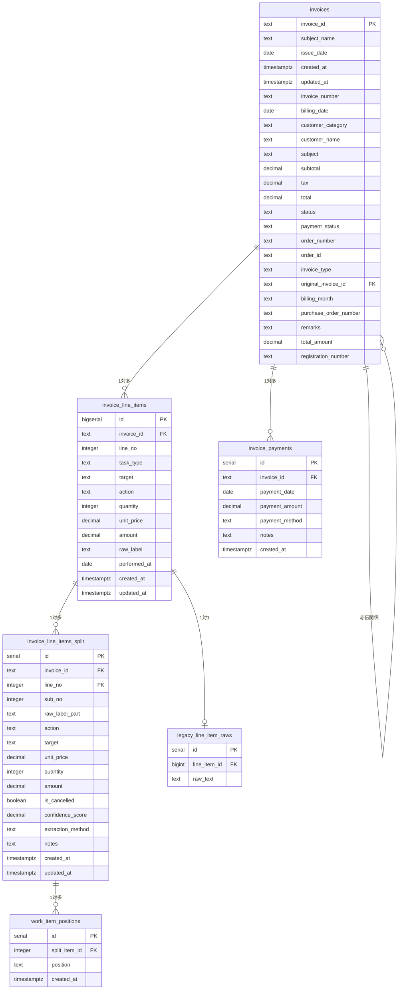

# データベース設計書 - 板金請求書システム

## 📋 システム概要

板金・整備業務の請求書管理システムのデータベース構造です。請求書の作成、明細管理、作業項目の分割表示、売上分析機能を提供します。

---

## 🗂️ テーブル構造

### 1. **invoices** - 請求書ヘッダー
**目的**: 請求書の基本情報を管理

| カラム名 | データ型 | NULL | デフォルト | 説明 | 例 |
|----------|----------|------|----------|------|-----|
| invoice_id | TEXT | NO | - | 請求書ID（主キー） | 25043371-1 |
| subject_name | TEXT | YES | - | 件名（元フィールド） | エンジン修理 |
| issue_date | DATE | YES | - | 発行日 | 2025-04-27 |
| created_at | TIMESTAMPTZ | YES | now() | 作成日時 | 2025-08-30T10:00:00Z |
| updated_at | TIMESTAMPTZ | YES | now() | 更新日時 | 2025-08-30T10:00:00Z |
| invoice_number | TEXT | YES | - | 請求書番号（invoice_idと同値） | 25043371-1 |
| billing_date | DATE | YES | - | 請求日 | 2025-04-27 |
| customer_category | TEXT | YES | 'その他' | 顧客カテゴリ | UD |
| customer_name | TEXT | YES | - | 顧客名 | UDトラックス株式会社 |
| subject | TEXT | YES | - | 件名 | エンジン修理 |
| subtotal | NUMERIC(12,0) | YES | 0 | 小計 | 13200 |
| tax | NUMERIC(12,0) | YES | 0 | 消費税 | 1200 |
| total | NUMERIC(12,0) | YES | 0 | 合計金額 | 14400 |
| status | TEXT | YES | 'draft' | ステータス | finalized |
| payment_status | TEXT | YES | 'unpaid' | 支払い状況 | unpaid |
| order_number | TEXT | YES | - | オーダー番号 | 2501852-01 |
| order_id | TEXT | YES | - | オーダーID | ord_123 |
| invoice_type | TEXT | YES | 'standard' | 請求書種別 | standard |
| original_invoice_id | TEXT | YES | - | 元請求書ID（赤伝用） | 25043371-1 |
| billing_month | TEXT | YES | - | 請求月（YYMM形式）| 2504 |
| purchase_order_number | TEXT | YES | - | 発注番号 | 1700414294 |
| remarks | TEXT | YES | - | 備考 | 特記事項 |
| total_amount | NUMERIC(12,0) | YES | 0 | 請求総額（旧） | 14400 |
| registration_number | TEXT | YES | - | 車両登録番号 | 品川500あ1234 |

#### **制約条件**

**status** の値（CHECKスペック）:
- `draft` - 下書き
- `finalized` - 確定
- `sent` - 送信済み
- `paid` - 支払済み

**payment_status** の値（CHECKスペック）:
- `paid` - 支払済み
- `unpaid` - 未払い
- `partial` - 一部入金

**customer_category** の値（CHECKスペック）:
- `UD` - UDトラックス関連
- `その他` - その他の顧客

**invoice_type** の値（CHECKスペック）:
- `standard` - 通常請求書
- `credit_note` - 赤伝（クレジットノート）

#### **自動計算トリガー**
- `subtotal`, `tax`, `total` は `invoice_line_items` の変更時に自動計算
- `tax` = `subtotal` × 0.1（四捨五入）
- `total` = `subtotal` × 1.1

---

### 2. **invoice_line_items** - 請求書明細
**目的**: 各請求書の作業項目明細を管理

| カラム名 | データ型 | NULL | デフォルト | 説明 | 例 |
|----------|----------|------|----------|------|-----|
| id | BIGSERIAL | NO | - | ID（主キー） | 1 |
| invoice_id | TEXT | NO | - | 請求書ID（外部キー） | 25043371-1 |
| line_no | INTEGER | NO | - | 明細行番号 | 1 |
| task_type | TEXT | NO | - | 作業タイプ | fuzzy |
| target | TEXT | YES | - | 対象物 | バンパー |
| action | TEXT | YES | - | 作業動作 | 脱着 |
| position | TEXT | YES | - | 部位 | 右前 |
| quantity | INTEGER | YES | - | 数量 | 1 |
| unit_price | NUMERIC(12,0) | YES | - | 単価 | 8000 |
| amount | NUMERIC(12,0) | YES | - | 金額 | 8000 |
| raw_label | TEXT | YES | - | 原文ラベル | 右バンパー脱着・修理 |
| performed_at | DATE | YES | - | 作業実施日 | 2025-04-27 |
| created_at | TIMESTAMPTZ | YES | now() | 作成日時 | 2025-08-30T10:00:00Z |
| updated_at | TIMESTAMPTZ | YES | now() | 更新日時 | 2025-08-30T10:00:00Z |

#### **task_type** の値
- `fuzzy` - 非構造化データ（分割対象）
- `structured` - 構造化データ（分解済み）
- `set` - セット作業
- `individual` - 個別作業

---

### 3. **invoice_line_items_split** - 作業明細分割項目
**目的**: 複合作業項目を個別の作業単位に分割して管理

| カラム名 | データ型 | NULL | デフォルト | 説明 | 例 |
|----------|----------|------|----------|------|-----|
| id | SERIAL | NO | - | ID（主キー） | 1 |
| invoice_id | TEXT | NO | - | 請求書ID | 25043371-1 |
| line_no | INTEGER | NO | - | 明細行番号 | 1 |
| sub_no | INTEGER | NO | - | 分割連番 | 1 |
| raw_label_part | TEXT | NO | - | 分割後の原文 | 左ファーストステップ |
| action | TEXT | YES | - | 作業動作 | 脱着 |
| target | TEXT | YES | - | 対象物 | ステップ |
| unit_price | DECIMAL(12,2) | NO | - | 単価 | 6000.00 |
| quantity | INTEGER | NO | - | 数量 | 1 |
| amount | DECIMAL(12,2) | NO | - | 金額 | 6000.00 |
| is_cancelled | BOOLEAN | NO | false | 取消しフラグ | false |
| confidence_score | DECIMAL(3,2) | YES | - | 抽出信頼度 | 0.95 |
| extraction_method | TEXT | YES | - | 抽出方法 | manual |
| notes | TEXT | YES | - | 備考 | 特殊加工 |
| created_at | TIMESTAMPTZ | YES | now() | 作成日時 | 2025-08-30T10:00:00Z |
| updated_at | TIMESTAMPTZ | YES | now() | 更新日時 | 2025-08-30T10:00:00Z |

---

### 4. **work_item_positions** - 作業項目位置情報
**目的**: 1つの作業項目が持つ複数の位置情報（例：「右」「前」）を正確に管理

| カラム名 | データ型 | NULL | デフォルト | 説明 | 例 |
|----------|----------|------|----------|------|-----|
| id | SERIAL | NO | - | ID（主キー） | 1 |
| split_item_id | INTEGER | NO | - | 分割項目ID（外部キー） | 1 |
| position | TEXT | NO | - | 位置 | 右 |
| created_at | TIMESTAMPTZ | YES | now() | 作成日時 | 2025-09-05T10:00:00Z |

---

### 5. **invoice_payments** - 請求書入金履歴
**目的**: 分割入金を含む、すべての入金履歴を正確に追跡管理

| カラム名 | データ型 | NULL | デフォルト | 説明 | 例 |
|----------|----------|------|----------|------|-----|
| id | SERIAL | NO | - | ID（主キー） | 1 |
| invoice_id | TEXT | NO | - | 請求書ID（外部キー） | 25043371-1 |
| payment_date | DATE | NO | - | 入金日 | 2025-05-15 |
| payment_amount | NUMERIC(12,0) | NO | - | 入金額 | 14400 |
| payment_method | TEXT | YES | - | 入金方法 | 銀行振込 |
| notes | TEXT | YES | - | 備考 | 一部入金 |
| created_at | TIMESTAMPTZ | YES | now() | 作成日時 | 2025-09-05T10:00:00Z |

---

### 6. **legacy_line_item_raws** - 旧システム原文データ
**目的**: 旧システムの曖昧な原文データを専用テーブルに隔離し、主要テーブルのデータ整合性を保つ

| カラム名 | データ型 | NULL | デフォルト | 説明 | 例 |
|----------|----------|------|----------|------|-----|
| id | SERIAL | NO | - | ID（主キー） | 1 |
| line_item_id | BIGINT | NO | - | 明細項目ID（外部キー） | 1 |
| raw_text | TEXT | NO | - | 原文テキスト | 右バンパー脱着・修理一式 |

#### **分割処理のルール**
- 原文ラベルを「・」「、」「/」で区切って分割
- 金額は等分配分、端数は最後のサブ項目に寄せる
- 親項目が amount=0 の場合、全サブ項目も amount=0 + is_cancelled=true

---

## 🔗 テーブル関係図



---

## 📊 データ関係性

### **1対多の関係**

#### invoices → invoice_line_items
- 1つの請求書に複数の明細項目
- 関連キー: `invoice_id`

#### invoices → invoice_payments
- 1つの請求書に複数の入金履歴（分割払い対応）
- 関連キー: `invoice_id`

#### invoice_line_items → invoice_line_items_split
- 1つの明細項目に複数の分割項目（任意）
- 関連キー: `invoice_id` + `line_no`

#### invoice_line_items_split → work_item_positions
- 1つの分割項目に複数の位置情報
- 関連キー: `split_item_id`

### **1対1の関係**

#### invoice_line_items ↔ legacy_line_item_raws
- 明細項目と旧システム原文データの対応
- 関連キー: `line_item_id`

### **自己参照関係**

#### invoices → invoices（赤伝関係）
- 赤伝が元請求書を参照
- 関連キー: `original_invoice_id`

---

## 🔧 インデックス設計

### **主要インデックス**
```sql
-- 請求書テーブル
PRIMARY KEY (invoice_id)
INDEX idx_invoices_issue_date ON invoices(issue_date)
INDEX idx_invoices_customer ON invoices(customer_name)
INDEX idx_invoices_type ON invoices(invoice_type)
INDEX idx_invoices_original ON invoices(original_invoice_id)

-- 明細テーブル  
PRIMARY KEY (id)
UNIQUE (invoice_id, line_no)
INDEX idx_line_items_invoice ON invoice_line_items(invoice_id)

-- 分割テーブル
PRIMARY KEY (id)
UNIQUE (invoice_id, line_no, sub_no)  
INDEX idx_split_invoice ON invoice_line_items_split(invoice_id)
INDEX idx_split_line ON invoice_line_items_split(invoice_id, line_no)

-- 位置テーブル
PRIMARY KEY (id)
INDEX idx_positions_split_item ON work_item_positions(split_item_id)

-- 入金履歴テーブル
PRIMARY KEY (id)
INDEX idx_payments_invoice ON invoice_payments(invoice_id)
INDEX idx_payments_date ON invoice_payments(payment_date)

-- 旧システム原文テーブル
PRIMARY KEY (id)
UNIQUE (line_item_id)
INDEX idx_legacy_line_item ON legacy_line_item_raws(line_item_id)
```

---

## 🔒 セキュリティ設定

### **Row Level Security (RLS)**
全テーブルでRLSを有効化し、現在はテスト用に全操作を許可:

```sql
-- 全テーブル共通ポリシー
CREATE POLICY "Enable all operations" ON [table_name]
  FOR ALL USING (true);
```

**本番環境では以下のような制限を想定:**
- ユーザー認証による行アクセス制御
- 組織・部門別のデータ分離
- 読み取り専用ユーザーの権限制限

---

## 📈 データ分析機能

### **売上管理で使用される集計**

#### 月別売上
```sql
SELECT 
  DATE_TRUNC('month', issue_date) as month,
  SUM(total) as amount,
  COUNT(*) as count
FROM invoices 
WHERE issue_date IS NOT NULL 
  AND invoice_type = 'standard' -- 通常請求書のみ
GROUP BY month
ORDER BY month;
```

#### 顧客別売上
```sql
SELECT 
  customer_name,
  SUM(total) as total_amount,
  COUNT(*) as invoice_count
FROM invoices 
WHERE customer_name IS NOT NULL 
  AND invoice_type = 'standard' -- 通常請求書のみ
GROUP BY customer_name
ORDER BY total_amount DESC;
```

#### 分割明細の表示（位置情報含む）
```sql
SELECT 
  i.invoice_id,
  i.customer_name,
  li.raw_label,
  s.raw_label_part,
  s.amount,
  s.quantity,
  s.is_cancelled,
  -- 位置情報を集約
  STRING_AGG(p.position, ',' ORDER BY p.position) as positions
FROM invoices i
JOIN invoice_line_items li ON i.invoice_id = li.invoice_id
LEFT JOIN invoice_line_items_split s ON li.invoice_id = s.invoice_id 
  AND li.line_no = s.line_no
LEFT JOIN work_item_positions p ON s.id = p.split_item_id
WHERE i.invoice_type = 'standard' -- 通常請求書のみ
GROUP BY i.invoice_id, i.customer_name, li.raw_label, s.raw_label_part, 
         s.amount, s.quantity, s.is_cancelled, li.line_no, s.sub_no
ORDER BY i.invoice_id, li.line_no, s.sub_no;
```

---

## 🎯 システム特徴

### **強み**
- **柔軟な分割表示**: 複合作業を個別項目として詳細管理
- **正確な金額按分**: 端数処理を含む自動計算
- **包括的な売上分析**: 月別・顧客別の多角的分析
- **取消し伝票対応**: 修正・取消し処理の完全サポート

### **拡張可能性**
- 作業マスター連携（action/target/position の正規化）
- 在庫管理システムとの連携
- 電子帳簿保存法対応
- API による外部システム連携

---

## 📝 運用ノート

### **データメンテナンス**
- 分割処理は手動実行（今回は Python スクリプト）
- 定期的なデータ整合性チェックを推奨
- バックアップは日次で実施

### **パフォーマンス考慮**
- 大量データ時は日付範囲での分割クエリを推奨
- 分割テーブルの件数が多い場合は追加インデックスを検討

---

## 📊 DB項目とツール項目の対比表

### **work-search ページとの連携**

#### **データ取得クエリ構造**
```sql
-- work-searchページで使用される基本クエリ
SELECT 
  li.id as line_item_id,
  li.raw_label as work_name,
  li.unit_price,
  li.quantity, 
  li.amount,
  li.task_type,
  li.invoice_id,
  i.customer_name,
  i.subject,
  i.registration_number,
  i.issue_date,
  TO_CHAR(i.issue_date, 'YYYY年MM月') as invoice_month
FROM invoice_line_items li
LEFT JOIN invoices i ON li.invoice_id = i.invoice_id
WHERE li.unit_price > 0
```

#### **DB項目 ↔ ツール項目 対応表**

| ツール表示項目 | DB項目 | 取得元テーブル | 変換ルール | 例 |
|---------------|--------|-------------|-----------|-----|
| **作業名** | `raw_label` | `invoice_line_items` | そのまま表示 | 右バンパー脱着・修理 |
| **単価** | `unit_price` | `invoice_line_items` | ¥{数値}形式で表示 | ¥8,000 |
| **数量** | `quantity` | `invoice_line_items` | 数値のみ表示 | 1 |
| **金額** | `amount` | `invoice_line_items` | ¥{数値}形式で表示 | ¥8,000 |
| **作業タイプ** | `task_type` | `invoice_line_items` | T:個別, S:セット変換 | T |
| **顧客名** | `customer_name` | `invoices` | そのまま表示 | UDトラックス株式会社 |
| **件名** | `subject` | `invoices` | そのまま表示 | エンジン修理 |
| **請求月** | `issue_date` | `invoices` | `TO_CHAR(issue_date, 'YYYY年MM月')` | 2025年04月 |
| **登録番号** | `registration_number` | `invoices` | そのまま表示 | 品川500あ1234 |

#### **作業タイプ変換ルール**
```typescript
// task_type → 表示文字変換
const taskTypeDisplay = (type: string) => {
  return type === 'set' ? 'S' : 'T';
};
```

#### **金額表示の問題**
⚠️ **既知の課題**: 現在多くのレコードで `amount` が 0 または NULL で表示される問題があり、今後の改善課題として記録済み

---

### **sales-management ページとの連携**

#### **データ取得クエリ構造**
```sql
-- sales-managementページで使用される基本クエリ（新設計）
SELECT 
  i.invoice_id,
  i.customer_name,
  i.subject,
  i.total,
  i.issue_date,
  i.payment_status,
  i.invoice_type,
  -- 入金合計の集計
  COALESCE(SUM(p.payment_amount), 0) as total_paid,
  -- 最新入金日
  MAX(p.payment_date) as last_payment_date
FROM invoices i
LEFT JOIN invoice_payments p ON i.invoice_id = p.invoice_id
WHERE i.invoice_type = 'standard' -- 通常請求書のみ
GROUP BY i.invoice_id, i.customer_name, i.subject, i.total, i.issue_date, i.payment_status, i.invoice_type
ORDER BY i.issue_date DESC
```

#### **DB項目 ↔ ツール項目 対応表**

| ツール表示項目 | DB項目 | 取得元テーブル | 変換ルール | 例 |
|---------------|--------|-------------|-----------|-----|
| **請求書番号** | `invoice_id` | `invoices` | そのまま表示 | 25043371-1 |
| **顧客名** | `customer_name` | `invoices` | そのまま表示 | UDトラックス株式会社 |
| **件名** | `subject` | `invoices` | そのまま表示 | エンジン修理 |
| **請求金額** | `total` | `invoices` | ¥{数値}形式で表示 | ¥14,400 |
| **入金合計** | `total_paid` | `invoice_payments`（集計） | ¥{数値}形式で表示 | ¥10,000 |
| **残額** | 計算値 | `total - total_paid` | ¥{数値}形式で表示 | ¥4,400 |
| **発行日** | `issue_date` | `invoices` | YYYY-MM-DD形式 | 2025-04-27 |
| **支払状況** | `payment_status` | `invoices` | 日本語変換 | 一部入金 |
| **最終入金日** | `last_payment_date` | `invoice_payments`（集計） | YYYY-MM-DD形式 | 2025-05-15 |

#### **入金詳細モーダルの対応表**

| ツール表示項目 | DB項目 | 取得元テーブル | 変換ルール | 例 |
|---------------|--------|-------------|-----------|-----|
| **入金日** | `payment_date` | `invoice_payments` | YYYY-MM-DD形式 | 2025-05-15 |
| **入金額** | `payment_amount` | `invoice_payments` | ¥{数値}形式で表示 | ¥10,000 |
| **入金方法** | `payment_method` | `invoice_payments` | そのまま表示 | 銀行振込 |
| **備考** | `notes` | `invoice_payments` | そのまま表示 | 一部入金分 |

#### **支払状況変換ルール**
```typescript
// payment_status → 日本語表示変換
const paymentStatusDisplay = (status: string) => {
  switch(status) {
    case 'paid': return '支払済み';
    case 'unpaid': return '未払い';
    case 'partial': return '一部入金';
    default: return status;
  }
};
```

---

### **invoice-create ページとの連携**

#### **新規請求書作成時のフィールドマッピング**

| フォーム項目 | DB項目 | 取得元テーブル | デフォルト値 | 必須 |
|-------------|--------|-------------|-----------|-----|
| **請求書ID** | `invoice_id` | `invoices` | 自動生成 | ✓ |
| **顧客名** | `customer_name` | `invoices` | - | ✓ |
| **件名** | `subject` | `invoices` | - | ✓ |
| **発行日** | `issue_date` | `invoices` | 今日の日付 | ✓ |
| **請求日** | `billing_date` | `invoices` | 発行日と同じ | - |
| **登録番号** | `registration_number` | `invoices` | - | - |
| **オーダー番号** | `order_number` | `invoices` | - | - |

#### **明細項目のフィールドマッピング**

| フォーム項目 | DB項目 | 取得元テーブル | 自動処理 |
|-------------|--------|-------------|---------|
| **作業内容** | `raw_label` | `invoice_line_items` | - |
| **単価** | `unit_price` | `invoice_line_items` | - |
| **数量** | `quantity` | `invoice_line_items` | デフォルト: 1 |
| **金額** | `amount` | `invoice_line_items` | 単価×数量で自動計算 |
| **作業タイプ** | `task_type` | `invoice_line_items` | デフォルト: 'individual' |

**最終更新**: 2025年9月5日（Claude Code更新 - 実際のSupabaseスキーマに基づく完全更新）

---

## 📊 作業価格検索ページ (work-search) との連携（詳細）

### **使用テーブル**
- `invoices` - 請求書ヘッダー情報
- `invoice_line_items` - 作業明細情報

### **データ結合ロジック**
```sql
-- work-searchページで使用されるクエリ構造
SELECT 
  li.id as line_item_id,
  li.raw_label as work_name,
  li.unit_price,
  li.quantity,
  li.invoice_id,
  i.customer_name,
  i.subject,
  i.registration_number,
  i.issue_date,
  CASE WHEN li.task_type = 'set' THEN true ELSE false END as is_set,
  -- 請求月の生成（issue_dateから）
  TO_CHAR(i.issue_date, 'YYYY年MM月') as invoice_month
FROM invoice_line_items li
LEFT JOIN invoices i ON li.invoice_id = i.invoice_id
WHERE li.unit_price > 0;
```

### **検索対象フィールド**
- `work_name` (作業名 - `raw_label`から取得)
- `customer_name` (顧客名)  
- `subject` (件名)
- `registration_number` (登録番号)
- `invoice_month` (請求月 - `issue_date`から生成)

### **パフォーマンス最適化**
```sql
-- 作業価格検索用の推奨インデックス
CREATE INDEX IF NOT EXISTS idx_line_items_unit_price ON invoice_line_items(unit_price);
CREATE INDEX IF NOT EXISTS idx_line_items_task_type ON invoice_line_items(task_type);
CREATE INDEX IF NOT EXISTS idx_invoices_issue_date_customer ON invoices(issue_date, customer_name);
```

**最終更新**: 2025年9月5日（Claude Code更新 - 実際のSupabaseスキーマに基づく完全更新）