# データベース設計書 - 板金請求書システム

## 📋 システム概要

板金・整備業務の請求書管理システムのデータベース構造です。請求書の作成、明細管理、作業項目の分割表示、売上分析機能を提供します。

---

## 🗂️ テーブル構造

### 1. **invoices** - 請求書ヘッダー
**目的**: 請求書の基本情報を管理

| カラム名 | データ型 | NULL | 説明 | 例 |
|----------|----------|------|------|-----|
| invoice_id | TEXT | NO | 請求書ID（主キー） | 25043371-1 |
| invoice_number | TEXT | YES | 請求書番号（表示用） | 25043371-1 |
| issue_date | DATE | YES | 発行日 | 2025-04-27 |
| billing_date | DATE | YES | 請求日 | 2025-04-27 |
| customer_name | TEXT | YES | 顧客名 | UDトラックス株式会社 |
| customer_category | TEXT | YES | 顧客カテゴリ | UD |
| subject | TEXT | YES | 件名 | エンジン修理 |
| subject_name | TEXT | YES | 件名（旧フィールド） | エンジン修理 |
| registration_number | TEXT | YES | 車両登録番号 | 品川500あ1234 |
| order_number | TEXT | YES | オーダー番号 | 2501852-01 |
| order_id | TEXT | YES | オーダーID | ord_123 |
| subtotal | NUMERIC(12,0) | YES | 小計 | 13200 |
| tax | NUMERIC(12,0) | YES | 消費税 | 1200 |
| total | NUMERIC(12,0) | YES | 合計金額 | 14400 |
| status | TEXT | YES | ステータス | finalized |
| payment_status | TEXT | YES | 支払い状況 | unpaid |
| payment_date | DATE | YES | 支払日 | 2025-05-15 |
| partial_payment_amount | NUMERIC(12,0) | YES | 一部入金額 | 5000 |
| created_at | TIMESTAMPTZ | YES | 作成日時 | 2025-08-30T10:00:00Z |
| updated_at | TIMESTAMPTZ | YES | 更新日時 | 2025-08-30T10:00:00Z |

#### **status** の値
- `draft` - 下書き
- `finalized` - 確定
- `sent` - 送信済み
- `paid` - 支払済み

#### **payment_status** の値
- `unpaid` - 未払い
- `paid` - 支払済み
- `partial` - 一部入金

#### **customer_category** の値
- `UD` - UDトラックス関連
- `その他` - その他の顧客

---

### 2. **invoice_line_items** - 請求書明細
**目的**: 各請求書の作業項目明細を管理

| カラム名 | データ型 | NULL | 説明 | 例 |
|----------|----------|------|------|-----|
| id | BIGSERIAL | NO | ID（主キー） | 1 |
| invoice_id | TEXT | NO | 請求書ID（外部キー） | 25043371-1 |
| line_no | INTEGER | NO | 明細行番号 | 1 |
| task_type | TEXT | NO | 作業タイプ | fuzzy |
| target | TEXT | YES | 対象物 | バンパー |
| action | TEXT | YES | 作業動作 | 脱着 |
| position | TEXT | YES | 部位 | 右前 |
| quantity | INTEGER | YES | 数量 | 1 |
| unit_price | NUMERIC(12,0) | YES | 単価 | 8000 |
| amount | NUMERIC(12,0) | YES | 金額 | 8000 |
| raw_label | TEXT | YES | 原文ラベル | 右バンパー脱着・修理 |
| performed_at | DATE | YES | 作業実施日 | 2025-04-27 |
| created_at | TIMESTAMPTZ | YES | 作成日時 | 2025-08-30T10:00:00Z |
| updated_at | TIMESTAMPTZ | YES | 更新日時 | 2025-08-30T10:00:00Z |

#### **task_type** の値
- `fuzzy` - 非構造化データ（分割対象）
- `structured` - 構造化データ（分解済み）
- `set` - セット作業
- `individual` - 個別作業

---

### 3. **invoice_line_items_split** - 作業明細分割項目
**目的**: 複合作業項目を個別の作業単位に分割して管理

| カラム名 | データ型 | NULL | 説明 | 例 |
|----------|----------|------|------|-----|
| id | SERIAL | NO | ID（主キー） | 1 |
| invoice_id | TEXT | NO | 請求書ID | 25043371-1 |
| line_no | INTEGER | NO | 明細行番号 | 1 |
| sub_no | INTEGER | NO | 分割連番 | 1 |
| raw_label_part | TEXT | NO | 分割後の原文 | 左ファーストステップ |
| action | TEXT | YES | 作業動作 | 脱着 |
| target | TEXT | YES | 対象物 | ステップ |
| position | TEXT | YES | 部位 | 左 |
| unit_price | DECIMAL(12,2) | NO | 単価 | 6000.00 |
| quantity | INTEGER | NO | 数量 | 1 |
| amount | DECIMAL(12,2) | NO | 金額 | 6000.00 |
| is_cancelled | BOOLEAN | NO | 取消しフラグ | false |
| confidence_score | DECIMAL(3,2) | YES | 抽出信頼度 | 0.95 |
| extraction_method | TEXT | YES | 抽出方法 | manual |
| notes | TEXT | YES | 備考 | 特殊加工 |
| created_at | TIMESTAMPTZ | YES | 作成日時 | 2025-08-30T10:00:00Z |
| updated_at | TIMESTAMPTZ | YES | 更新日時 | 2025-08-30T10:00:00Z |

#### **分割処理のルール**
- 原文ラベルを「・」「、」「/」で区切って分割
- 金額は等分配分、端数は最後のサブ項目に寄せる
- 親項目が amount=0 の場合、全サブ項目も amount=0 + is_cancelled=true

---

## 🔗 テーブル関係図

```mermaid
erDiagram
    invoices {
        text invoice_id PK
        date issue_date
        text customer_name
        text subject_name
        text registration_number
        decimal billing_month
        text purchase_order_number
        text order_number
        text remarks
        decimal subtotal
        decimal tax
        decimal total_amount
        text status
        text payment_status
        timestamptz created_at
        timestamptz updated_at
    }
    
    invoice_line_items {
        serial id PK
        text invoice_id FK
        integer line_no
        text task_type
        text target
        text action
        text position
        integer quantity
        decimal unit_price
        decimal amount
        text raw_label
        date performed_at
        timestamptz created_at
        timestamptz updated_at
    }
    
    invoice_line_items_split {
        serial id PK
        text invoice_id FK
        integer line_no FK
        integer sub_no
        text raw_label_part
        text action
        text target
        text position
        decimal unit_price
        integer quantity
        decimal amount
        boolean is_cancelled
        decimal confidence_score
        text extraction_method
        text notes
        timestamptz created_at
        timestamptz updated_at
    }

    invoices ||--o{ invoice_line_items : "1対多"
    invoice_line_items ||--o{ invoice_line_items_split : "1対多"
```



---

## 📊 データ関係性

### **1対多の関係**

#### invoices → invoice_line_items
- 1つの請求書に複数の明細項目
- 関連キー: `invoice_id`

#### invoice_line_items → invoice_line_items_split
- 1つの明細項目に複数の分割項目（任意）
- 関連キー: `invoice_id` + `line_no`

---

## 🔧 インデックス設計

### **主要インデックス**
```sql
-- 請求書テーブル
PRIMARY KEY (invoice_id)
INDEX idx_invoices_issue_date ON invoices(issue_date)
INDEX idx_invoices_customer ON invoices(customer_name)

-- 明細テーブル  
PRIMARY KEY (id)
UNIQUE (invoice_id, line_no)
INDEX idx_line_items_invoice ON invoice_line_items(invoice_id)

-- 分割テーブル
PRIMARY KEY (id)
UNIQUE (invoice_id, line_no, sub_no)  
INDEX idx_split_invoice ON invoice_line_items_split(invoice_id)
INDEX idx_split_line ON invoice_line_items_split(invoice_id, line_no)
```

---

## 🔒 セキュリティ設定

### **Row Level Security (RLS)**
全テーブルでRLSを有効化し、現在はテスト用に全操作を許可:

```sql
-- 全テーブル共通ポリシー
CREATE POLICY "Enable all operations" ON [table_name]
  FOR ALL USING (true);
```

**本番環境では以下のような制限を想定:**
- ユーザー認証による行アクセス制御
- 組織・部門別のデータ分離
- 読み取り専用ユーザーの権限制限

---

## 📈 データ分析機能

### **売上管理で使用される集計**

#### 月別売上
```sql
SELECT 
  DATE_TRUNC('month', issue_date) as month,
  SUM(total_amount) as amount,
  COUNT(*) as count
FROM invoices 
WHERE issue_date IS NOT NULL
GROUP BY month
ORDER BY month;
```

#### 顧客別売上
```sql
SELECT 
  customer_name,
  SUM(total_amount) as total_amount,
  COUNT(*) as invoice_count
FROM invoices 
WHERE customer_name IS NOT NULL
GROUP BY customer_name
ORDER BY total_amount DESC;
```

#### 分割明細の表示
```sql
SELECT 
  i.invoice_id,
  i.customer_name,
  li.raw_label,
  s.raw_label_part,
  s.amount,
  s.quantity,
  s.is_cancelled
FROM invoices i
JOIN invoice_line_items li ON i.invoice_id = li.invoice_id
LEFT JOIN invoice_line_items_split s ON li.invoice_id = s.invoice_id 
  AND li.line_no = s.line_no
ORDER BY i.invoice_id, li.line_no, s.sub_no;
```

---

## 🎯 システム特徴

### **強み**
- **柔軟な分割表示**: 複合作業を個別項目として詳細管理
- **正確な金額按分**: 端数処理を含む自動計算
- **包括的な売上分析**: 月別・顧客別の多角的分析
- **取消し伝票対応**: 修正・取消し処理の完全サポート

### **拡張可能性**
- 作業マスター連携（action/target/position の正規化）
- 在庫管理システムとの連携
- 電子帳簿保存法対応
- API による外部システム連携

---

## 📝 運用ノート

### **データメンテナンス**
- 分割処理は手動実行（今回は Python スクリプト）
- 定期的なデータ整合性チェックを推奨
- バックアップは日次で実施

### **パフォーマンス考慮**
- 大量データ時は日付範囲での分割クエリを推奨
- 分割テーブルの件数が多い場合は追加インデックスを検討

**最終更新**: 2025年9月4日（Claude Code更新）

---

## 📊 作業価格検索ページ (work-search) との連携

### **使用テーブル**
- `invoices` - 請求書ヘッダー情報
- `invoice_line_items` - 作業明細情報

### **データ結合ロジック**
```sql
-- work-searchページで使用されるクエリ構造
SELECT 
  li.id as line_item_id,
  li.raw_label as work_name,
  li.unit_price,
  li.quantity,
  li.invoice_id,
  i.customer_name,
  i.subject,
  i.registration_number,
  i.issue_date,
  CASE WHEN li.task_type = 'set' THEN true ELSE false END as is_set,
  -- 請求月の生成（issue_dateから）
  TO_CHAR(i.issue_date, 'YYYY年MM月') as invoice_month
FROM invoice_line_items li
LEFT JOIN invoices i ON li.invoice_id = i.invoice_id
WHERE li.unit_price > 0;
```

### **検索対象フィールド**
- `work_name` (作業名 - `raw_label`から取得)
- `customer_name` (顧客名)  
- `subject` (件名)
- `registration_number` (登録番号)
- `invoice_month` (請求月 - `issue_date`から生成)

### **パフォーマンス最適化**
```sql
-- 作業価格検索用の推奨インデックス
CREATE INDEX IF NOT EXISTS idx_line_items_unit_price ON invoice_line_items(unit_price);
CREATE INDEX IF NOT EXISTS idx_line_items_task_type ON invoice_line_items(task_type);
CREATE INDEX IF NOT EXISTS idx_invoices_issue_date_customer ON invoices(issue_date, customer_name);
```

**最終更新**: 2025年9月4日（Claude Code更新）