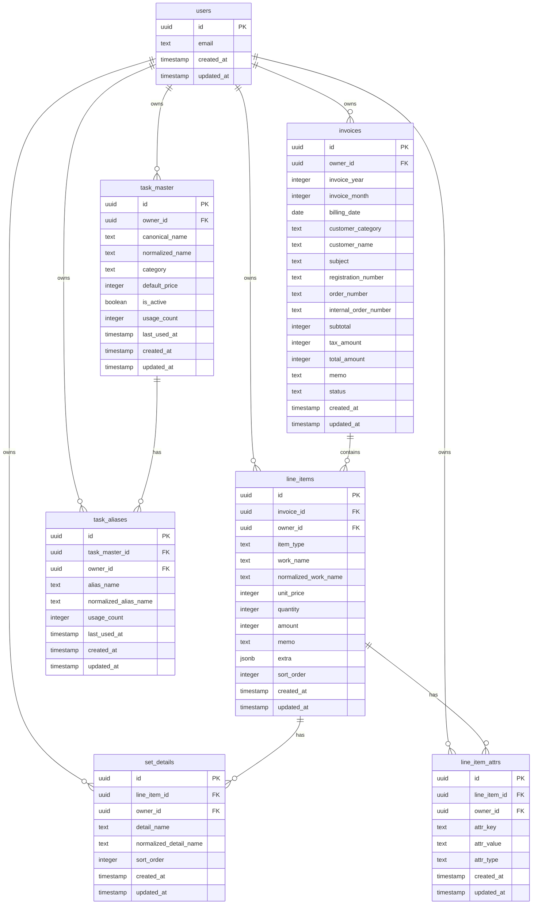

# 作業入力ツール - データベース設計書

## 目的・要件の要約

新しい作業入力ツールのための拡張性の高いデータベーススキーマを設計する。
既存のlocalStorageベースのシステムから、Supabase（PostgreSQL互換）への移行を想定し、
将来の機能追加や仕様変更に対応できる柔軟な構造を提供する。

### 主要要件
- **2種類の入力方式**：個別作業とセット作業
- **拡張性**：将来的な項目追加に対応
- **正規化**：作業名の表記ゆれ対策
- **セキュリティ**：RLS（Row Level Security）によるユーザー分離
- **パフォーマンス**：効率的な集計・検索機能

## ER図



## テーブル定義

### 1. invoices（請求書ヘッダー）

**用途**: 請求書の基本情報を管理。現在の「請求書作成」ページの上部フォーム内容に対応
**画面対応**: 請求書一覧、請求書作成、請求書詳細表示

| 列名 | 型 | 制約 | 説明 | 画面での用途・表示場所 | 拡張の余地 |
|------|----|----|----|---------------------|-----------|
| id | uuid | PRIMARY KEY, DEFAULT gen_random_uuid() | 請求書ID | URLパラメータ、内部リンク | - |
| owner_id | uuid | NOT NULL, REFERENCES auth.users(id) | 所有者ID（RLS用） | 画面には非表示（セキュリティ用） | - |
| invoice_year | integer | NOT NULL, CHECK (invoice_year > 2020) | 請求データ年 | 請求書作成フォーム「請求データ年月」 | - |
| invoice_month | integer | NOT NULL, CHECK (invoice_month BETWEEN 1 AND 12) | 請求データ月 | 請求書作成フォーム「請求データ年月」 | - |
| billing_date | date | NOT NULL | 請求日（発行日） | 請求書作成フォーム「請求日」、一覧での日付表示 | - |
| customer_category | text | NOT NULL | 顧客カテゴリー | 請求書作成フォーム「顧客カテゴリ」ラジオボタン | dynamic_categories対応可能 |
| customer_name | text | NOT NULL | 顧客名 | 請求書作成フォーム「顧客名」、一覧でのタイトル | - |
| subject | text | NOT NULL | 件名 | 請求書作成フォーム「件名」、一覧でのサブタイトル | - |
| registration_number | text | | 登録番号 | 請求書作成フォーム「登録番号」（任意入力） | - |
| order_number | text | | 発注番号 | 請求書作成フォーム「発注番号」（任意入力） | - |
| internal_order_number | text | | 内部オーダー番号 | 請求書作成フォーム「オーダー番号」（任意入力） | - |
| subtotal | integer | NOT NULL, DEFAULT 0 | 小計（円） | 請求書作成画面右側「金額計算」パネル | - |
| tax_amount | integer | NOT NULL, DEFAULT 0 | 消費税額（円） | 請求書作成画面右側「消費税 (10%)」 | - |
| total_amount | integer | NOT NULL, DEFAULT 0 | 合計金額（円） | 請求書作成画面右側「合計」、一覧での金額表示 | - |
| memo | text | | メモ | 請求書作成フォーム「メモ」セクション（任意入力） | - |
| status | text | NOT NULL, DEFAULT 'draft', CHECK (status IN ('draft', 'finalized', 'sent', 'paid', 'cancelled')) | ステータス | 一覧でのステータス表示、フィルタ機能 | 新ステータス追加可能 |
| created_at | timestamp with time zone | NOT NULL, DEFAULT now() | 作成日時 | 一覧での作成日表示、並び順 | - |
| updated_at | timestamp with time zone | NOT NULL, DEFAULT now() | 更新日時 | 最終更新日の表示 | - |

### 2. line_items（明細行）

**用途**: 請求書の作業項目（個別作業・セット作業）を管理。現在の「作業項目」セクションに対応
**画面対応**: 請求書作成の作業項目リスト、請求書詳細、作業検索

| 列名 | 型 | 制約 | 説明 | 画面での用途・表示場所 | 拡張の余地 |
|------|----|----|----|---------------------|-----------|
| id | uuid | PRIMARY KEY, DEFAULT gen_random_uuid() | 明細ID | 内部処理用（画面には非表示） | - |
| invoice_id | uuid | NOT NULL, REFERENCES invoices(id) ON DELETE CASCADE | 請求書ID | 親子関係の管理（画面には非表示） | - |
| owner_id | uuid | NOT NULL, REFERENCES auth.users(id) | 所有者ID（RLS用） | セキュリティ用（画面には非表示） | - |
| item_type | text | NOT NULL, CHECK (item_type IN ('individual', 'set')) | 項目種別 | 作業項目の「個別作業」「セット作業」選択 | 新種別追加可能 |
| work_name | text | NOT NULL | 作業名（原表記） | 作業項目の「作業名」入力フィールド、サジェスト表示 | - |
| normalized_work_name | text | NOT NULL | 作業名（正規化済み） | 内部検索用（画面には非表示、自動生成） | 検索・マッチング用 |
| unit_price | integer | NOT NULL, CHECK (unit_price >= 0) | 単価（円） | 作業項目の「単価」入力フィールド | - |
| quantity | integer | NOT NULL, DEFAULT 1, CHECK (quantity > 0) | 数量 | 作業項目の「数量」入力フィールド | - |
| amount | integer | NOT NULL, CHECK (amount >= 0) | 金額（円） | 作業項目の「金額」計算結果表示、合計計算に使用 | - |
| memo | text | | メモ | 作業項目の「メモ」入力フィールド（任意） | - |
| extra | jsonb | | 拡張データ（JSON） | 現在は未使用、将来の機能拡張用 | 将来項目の受け皿 |
| sort_order | integer | NOT NULL, DEFAULT 0 | 表示順序 | 作業項目の表示順序（ドラッグ&ドロップ対応） | - |
| created_at | timestamp with time zone | NOT NULL, DEFAULT now() | 作成日時 | 作業履歴、最近使った作業の判定 | - |
| updated_at | timestamp with time zone | NOT NULL, DEFAULT now() | 更新日時 | 変更履歴の管理 | - |

### 3. set_details（セット詳細）

**用途**: セット作業の詳細内訳を管理。現在の「セット詳細」入力に対応
**画面対応**: 請求書作成でセット作業選択時の詳細項目入力

| 列名 | 型 | 制約 | 説明 | 画面での用途・表示場所 | 拡張の余地 |
|------|----|----|----|---------------------|-----------|
| id | uuid | PRIMARY KEY, DEFAULT gen_random_uuid() | 詳細ID | 内部処理用（画面には非表示） | - |
| line_item_id | uuid | NOT NULL, REFERENCES line_items(id) ON DELETE CASCADE | 明細ID | 親作業項目との関連付け（画面には非表示） | - |
| owner_id | uuid | NOT NULL, REFERENCES auth.users(id) | 所有者ID（RLS用） | セキュリティ用（画面には非表示） | - |
| detail_name | text | NOT NULL | 詳細作業名（原表記） | セット作業の「詳細項目」入力フィールド | - |
| normalized_detail_name | text | NOT NULL | 詳細作業名（正規化済み） | 内部検索用（画面には非表示、自動生成） | 検索・マッチング用 |
| sort_order | integer | NOT NULL, DEFAULT 0 | 表示順序 | セット詳細の表示順序（並び替え可能） | - |
| created_at | timestamp with time zone | NOT NULL, DEFAULT now() | 作成日時 | 履歴管理用 | - |
| updated_at | timestamp with time zone | NOT NULL, DEFAULT now() | 更新日時 | 変更履歴用 | - |

### 4. task_master（作業マスタ）

**用途**: 作業名の正規表記を管理。サジェスト機能と価格履歴の基盤
**画面対応**: 作業名入力時のサジェスト、作業検索、価格履歴

| 列名 | 型 | 制約 | 説明 | 画面での用途・表示場所 | 拡張の余地 |
|------|----|----|----|---------------------|-----------|
| id | uuid | PRIMARY KEY, DEFAULT gen_random_uuid() | マスタID | 内部処理用（画面には非表示） | - |
| owner_id | uuid | NOT NULL, REFERENCES auth.users(id) | 所有者ID（RLS用） | セキュリティ用（画面には非表示） | - |
| canonical_name | text | NOT NULL | 正規作業名 | サジェスト候補として表示、作業検索結果 | - |
| normalized_name | text | NOT NULL | 正規化済み名称 | 内部検索処理用（画面には非表示） | 検索・マッチング用 |
| category | text | | 作業カテゴリー | 作業検索のカテゴリーフィルタ、統計表示 | カテゴリー体系拡張可能 |
| default_price | integer | CHECK (default_price >= 0) | デフォルト単価（円） | 作業名選択時の価格自動入力、価格サジェスト | - |
| is_active | boolean | NOT NULL, DEFAULT true | 有効フラグ | 非表示・削除された作業の管理用 | - |
| usage_count | integer | NOT NULL, DEFAULT 0 | 使用回数 | サジェスト候補の優先度、人気作業ランキング | - |
| last_used_at | timestamp with time zone | | 最終使用日時 | 最近使った作業のサジェスト優先度 | - |
| created_at | timestamp with time zone | NOT NULL, DEFAULT now() | 作成日時 | 新しい作業の判定 | - |
| updated_at | timestamp with time zone | NOT NULL, DEFAULT now() | 更新日時 | データ更新の履歴 | - |

### 5. task_aliases（作業別名）

**用途**: 同じ作業の異なる表記を管理。表記ゆれ対策とサジェスト精度向上
**画面対応**: 作業名入力のサジェスト候補拡充、表記統一機能

| 列名 | 型 | 制約 | 説明 | 画面での用途・表示場所 | 拡張の余地 |
|------|----|----|----|---------------------|-----------|
| id | uuid | PRIMARY KEY, DEFAULT gen_random_uuid() | 別名ID | 内部処理用（画面には非表示） | - |
| task_master_id | uuid | NOT NULL, REFERENCES task_master(id) ON DELETE CASCADE | マスタID | 正規名との関連付け（画面には非表示） | - |
| owner_id | uuid | NOT NULL, REFERENCES auth.users(id) | 所有者ID（RLS用） | セキュリティ用（画面には非表示） | - |
| alias_name | text | NOT NULL | 別名（原表記） | サジェスト候補として表示（「○○ → 正規名」形式） | - |
| normalized_alias_name | text | NOT NULL | 別名（正規化済み） | 内部検索処理用（画面には非表示） | 検索・マッチング用 |
| usage_count | integer | NOT NULL, DEFAULT 0 | 使用回数 | 別名の使用頻度表示、サジェスト優先度 | - |
| last_used_at | timestamp with time zone | | 最終使用日時 | 最近使った別名の優先度 | - |
| created_at | timestamp with time zone | NOT NULL, DEFAULT now() | 作成日時 | 別名登録日の記録 | - |
| updated_at | timestamp with time zone | NOT NULL, DEFAULT now() | 更新日時 | 別名更新の履歴 | - |

### 6. line_item_attrs（EAV拡張属性）

**用途**: 作業項目の動的な属性を管理。将来の機能拡張用
**画面対応**: 現在は未使用、将来のカスタムフィールド機能で利用予定

| 列名 | 型 | 制約 | 説明 | 画面での用途・表示場所 | 拡張の余地 |
|------|----|----|----|---------------------|-----------|
| id | uuid | PRIMARY KEY, DEFAULT gen_random_uuid() | 属性ID | 内部処理用（画面には非表示） | - |
| line_item_id | uuid | NOT NULL, REFERENCES line_items(id) ON DELETE CASCADE | 明細ID | 対象作業項目の特定（画面には非表示） | - |
| owner_id | uuid | NOT NULL, REFERENCES auth.users(id) | 所有者ID（RLS用） | セキュリティ用（画面には非表示） | - |
| attr_key | text | NOT NULL | 属性キー | 将来のカスタムフィールド名（例：「緊急度」「担当者」） | - |
| attr_value | text | | 属性値 | 将来のカスタムフィールド値（例：「高」「田中」） | - |
| attr_type | text | NOT NULL, DEFAULT 'text', CHECK (attr_type IN ('text', 'number', 'boolean', 'date', 'json')) | 属性型 | フィールドタイプ指定（テキスト/数値/日付など） | 新型追加可能 |
| created_at | timestamp with time zone | NOT NULL, DEFAULT now() | 作成日時 | 履歴管理用 | - |
| updated_at | timestamp with time zone | NOT NULL, DEFAULT now() | 更新日時 | 変更履歴用 | - |

## RLSポリシー方針

### 基本方針
- 全テーブルで `owner_id = auth.uid()` による完全分離
- SELECT、INSERT、UPDATE、DELETE 全操作でRLSを適用
- 管理者権限は別途検討（将来拡張）

### ポリシー例

```sql
-- invoices テーブル
ALTER TABLE invoices ENABLE ROW LEVEL SECURITY;
CREATE POLICY "Users can manage their own invoices" ON invoices
    FOR ALL USING (owner_id = auth.uid());

-- 同様に全テーブルで適用
```

## インデックス戦略

### パフォーマンス重要インデックス

```sql
-- 基本検索用
CREATE INDEX idx_invoices_owner_billing_date ON invoices (owner_id, billing_date DESC);
CREATE INDEX idx_line_items_owner_invoice ON line_items (owner_id, invoice_id);
CREATE INDEX idx_set_details_line_item ON set_details (line_item_id, sort_order);

-- 作業名検索用
CREATE INDEX idx_line_items_normalized_work_name ON line_items USING gin (normalized_work_name gin_trgm_ops);
CREATE INDEX idx_task_master_normalized_name ON task_master USING gin (normalized_name gin_trgm_ops);
CREATE INDEX idx_task_aliases_normalized_name ON task_aliases USING gin (normalized_alias_name gin_trgm_ops);

-- 集計用
CREATE INDEX idx_line_items_owner_created_amount ON line_items (owner_id, created_at DESC, amount);
CREATE INDEX idx_invoices_owner_status_total ON invoices (owner_id, status, total_amount);

-- 頻度・サジェスト用
CREATE INDEX idx_task_master_usage ON task_master (owner_id, usage_count DESC, last_used_at DESC);
CREATE INDEX idx_task_aliases_usage ON task_aliases (task_master_id, usage_count DESC, last_used_at DESC);
```

## 正規化ルールとマスタ運用

### 正規化ルール（NFKC + 記号除去）

```sql
-- 正規化関数例
CREATE OR REPLACE FUNCTION normalize_simple(input_text text)
RETURNS text AS $$
BEGIN
  RETURN TRIM(
    REGEXP_REPLACE(
      LOWER(NORMALIZE(COALESCE(input_text, ''), 'NFKC')),
      '[^a-zA-Z0-9ぁ-んァ-ヶ一-龯]',
      '',
      'g'
    )
  );
END;
$$ LANGUAGE plpgsql IMMUTABLE;
```

### マスタ運用フロー

1. **新規作業名入力時**
   - 正規化した名前で `task_master` + `task_aliases` を検索
   - マッチした場合：既存マスタを使用、usage_count++
   - 未マッチの場合：新規マスタ作成 + 入力値を別名として登録

2. **表記ゆれ検出**
   - 定期的にバッチで類似の正規化名を検出
   - 手動マージツールで統合判断

## 拡張戦略：extra jsonb vs line_item_attrs（EAV）

### extra jsonb アプローチ

**メリット**：
- シンプルで高速
- PostgreSQLのjsonb機能フル活用
- スキーマ変更不要

**デメリット**：
- 型安全性が低い
- 複雑な検索が困難
- インデックス戦略が限定的

### line_item_attrs（EAV）アプローチ

**メリット**：
- 強い型チェック
- 柔軟な検索・集計
- 細かいアクセス制御可能

**デメリット**：
- JOIN多用によるパフォーマンス影響
- クエリが複雑化

### 推奨採用順序

1. **短期（初期実装）**：`extra jsonb` を採用
   - 開発速度優先
   - 単純な拡張データに対応

2. **中長期（機能拡充後）**：`line_item_attrs` に段階移行
   - 複雑な検索要件が出てきた段階で検討
   - 必要に応じて両方併用も可能

## 代表的なSELECT例

### 1. 売上集計（月別）

```sql
-- 月別売上集計
SELECT 
    invoice_year,
    invoice_month,
    COUNT(*) as invoice_count,
    SUM(total_amount) as total_sales,
    AVG(total_amount) as avg_amount
FROM invoices 
WHERE owner_id = auth.uid() 
    AND status IN ('finalized', 'sent', 'paid')
GROUP BY invoice_year, invoice_month
ORDER BY invoice_year DESC, invoice_month DESC;
```

### 2. セット展開表示

```sql
-- セット作業の詳細展開
SELECT 
    li.work_name,
    li.amount,
    li.item_type,
    sd.detail_name,
    sd.sort_order
FROM line_items li
LEFT JOIN set_details sd ON li.id = sd.line_item_id
WHERE li.invoice_id = $1 
    AND li.owner_id = auth.uid()
ORDER BY li.sort_order, sd.sort_order;
```

### 3. 最近使った作業サジェスト

```sql
-- よく使う作業名のサジェスト
SELECT DISTINCT
    tm.canonical_name,
    tm.default_price,
    tm.usage_count,
    tm.last_used_at
FROM task_master tm
WHERE tm.owner_id = auth.uid()
    AND tm.is_active = true
    AND tm.normalized_name LIKE normalize_simple($1) || '%'
ORDER BY tm.usage_count DESC, tm.last_used_at DESC
LIMIT 10;
```

### 4. 表記ゆれ検出

```sql
-- 類似作業名の検出（要統合候補）
WITH similar_tasks AS (
    SELECT 
        tm1.id as id1,
        tm1.canonical_name as name1,
        tm2.id as id2,
        tm2.canonical_name as name2,
        similarity(tm1.normalized_name, tm2.normalized_name) as sim_score
    FROM task_master tm1
    CROSS JOIN task_master tm2
    WHERE tm1.id < tm2.id 
        AND tm1.owner_id = auth.uid()
        AND tm2.owner_id = auth.uid()
        AND similarity(tm1.normalized_name, tm2.normalized_name) > 0.7
)
SELECT * FROM similar_tasks
ORDER BY sim_score DESC;
```

## 将来列追加の設計指針

### 1. ビューで吸収

```sql
-- アプリケーション安定ビュー
CREATE VIEW v_invoices_stable AS
SELECT 
    id,
    billing_date,
    customer_name,
    subject,
    total_amount,
    status
    -- 新列追加時はここに追加、アプリは無影響
FROM invoices
WHERE owner_id = auth.uid();
```

### 2. CHECKで安全

```sql
-- 新しい列追加時の制約例
ALTER TABLE invoices 
ADD COLUMN payment_method text 
CHECK (payment_method IN ('bank_transfer', 'credit_card', 'cash', 'other'));
```

### 3. 移行手順の雛形

```sql
-- Step 1: 新列追加（NULLable）
ALTER TABLE invoices ADD COLUMN new_field text;

-- Step 2: デフォルト値設定
UPDATE invoices SET new_field = 'default_value' WHERE new_field IS NULL;

-- Step 3: NOT NULL制約追加
ALTER TABLE invoices ALTER COLUMN new_field SET NOT NULL;

-- Step 4: CHECK制約追加（必要に応じて）
ALTER TABLE invoices ADD CONSTRAINT check_new_field 
CHECK (new_field IN ('value1', 'value2', 'value3'));
```

## 実装優先度

### Phase 1（MVP）
- [ ] invoices, line_items, set_details の基本構造
- [ ] 基本的なRLSポリシー
- [ ] 必要最小限のインデックス

### Phase 2（機能拡充）
- [ ] task_master, task_aliases による正規化
- [ ] extra jsonb による拡張データ対応
- [ ] パフォーマンス最適化

### Phase 3（高度機能）
- [ ] line_item_attrs による複雑な拡張
- [ ] 表記ゆれ検出・統合機能
- [ ] 高度な分析・レポート機能

---

この設計書に基づき、実際のDDLやビュー定義を次のステップで作成していきます。